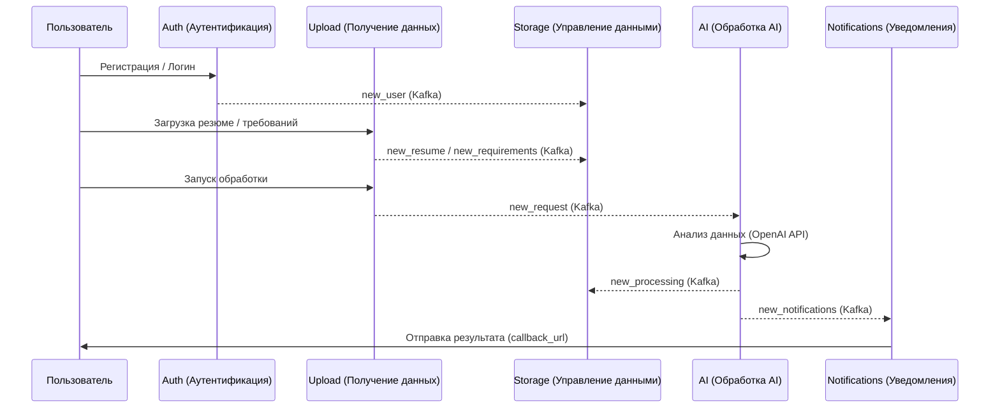

# **Общая архитектура системы микросервисов**

## 📌 Обзор

Система состоит из пяти микросервисов, каждый из которых отвечает за свою часть логики. Все сервисы взаимодействуют между собой через **Kafka** и обмениваются данными в **Redis** и **PostgreSQL**.

Стек: **Python, FastAPI, SQLAlchemy, PostgreSQL, Confluent-kafka, Redis, Pytest, Docker**

Основные компоненты:

* **Kafka** — основной канал асинхронного обмена событиями между сервисами.
* **Redis** — используется как кэш и для хранения временных меток о выполненных действиях.
* **PostgreSQL** — основное хранилище данных пользователей, резюме, требований и результатов обработки.
* **OpenAI API** — используется сервисом AI-обработки для анализа резюме.

---

## 🗂 Состав микросервисов

В каждом микросервисек реализован docker-compose

### 1. **Сервис аутентификации**

* Регистрация и вход пользователей с JWT.
* Ограничение активных сессий, защита от brute-force.
* При регистрации отправляет событие `new_user` в Kafka (`uploading_data`).
* Кэширует данные пользователей в Redis.
* Ссылка: https://github.com/IvanShankin/API_handler_resume_auth_service

### 2. **Сервис получения данных от пользователя**

* Получает от пользователя резюме и требования.
* Сохраняет их в БД и Redis.
* Отправляет события в Kafka (`uploading_data`):

  * `new_resume`
  * `new_requirements`
  * `delete_processing`
  * `delete_requirements`
  * `new_processing` (от AI)
* Отправляет запросы на AI-обработку в Kafka (`AI_handler` → `new_request`).
*  Ссылка: https://github.com/IvanShankin/API_handler_resume_upload_service

### 3. **Сервис управления данными пользователей**

* Хранит и отдает информацию о пользователях, резюме, требованиях и обработках.
* Получает данные через Kafka (`uploading_data`) по ключам:

  * `new_user`
  * `new_resume`
  * `new_requirements`
  * `delete_processing`
  * `delete_requirements`
  * `new_processing`
* Кэширует их в Redis.
* Ссылка: https://github.com/IvanShankin/API_handler_resume_storage_service

### 4. **Сервис AI-обработки**
ОБЯЗАТЕЛЬНО ОТПРАВЛЯТЬ ЗАПРОСЫ К GPT НЕ С ТЕРРИТОРИИ РФ
* Получает из Kafka (`AI_handler`) события `new_request`.
* Запрашивает OpenAI API для анализа резюме по требованиям.
* Отправляет результаты:
  * В Kafka (`notifications`) → для отправки пользователю.
  * В Kafka (`uploading_data`) → для сохранения в БД.
* Ссылка: https://github.com/IvanShankin/API_handler_resume_AI_handler_service

### 5. **Сервис уведомлений**

* Получает из Kafka (`notifications`) события `new_notifications`.
* Отправляет результаты анализа или сообщения об ошибках на `callback_url`.
* Кэширует метки обработанных уведомлений в Redis.
* Ссылка: https://github.com/IvanShankin/API_handler_resume_notifications_service

---

## 🗄 Redis: использование в сервисах

| Сервис            | Что хранит                                                             |
|-------------------| ---------------------------------------------------------------------- |
| **Auth**          | Данные пользователей (TTL: 30 мин), блокировки входа, счетчики попыток |
| **Upload**        | Временные резюме и требования, счетчики лимитов обработки              |
| **Storage**       | Полные данные пользователей, резюме, требований, обработок (без TTL)   |
| **AI**            | Метки обработанных сообщений (3 дня)                                   |
| **Notifications** | Метки отправленных уведомлений (3 дня)                                 |

---

## 📤 Поток данных (пример)

1. Пользователь регистрируется в **Auth** → `new_user` в Kafka (`uploading_data`).
2. **Storage** получает событие и сохраняет данные.
3. Пользователь загружает резюме в **Upload** → `/create_resume/file` 
4. Пользователь загружает требования в **Upload** → `/create_requirements/file` 
5. Все данные передаются по Kafka (`uploading_data`) **Storage** сохраняет их.
6. Пользователь запускает обработку в **Upload** → `/start_processing` 
7. **Upload** отправляет `new_request` в Kafka (`AI_handler`).
8. **AI** читает `new_request`, обращается к OpenAI API, отправляет:
   * `new_processing` в Kafka (`uploading_data`) → сохраняет **Storage**.
   * `new_notifications` в Kafka (`notifications`) → читает **Notifications**.
9. **Storage** сохраняет результат.
10. **Notifications** отправляет результат на `callback_url`.

---

## 🔗 Взаимодействие сервисов



## Отфильтрованные записи Kafka по топикам

### Топик `uploading_data`
1. **Микросервис Auth**  
   ```python
   topic = uploading_data
   key = 'new_user'
   json = {
       'user_id': int,
       'username': str,
       'full_name': str,
       'created_at': str,
   }
   ```

2. **Микросервис Upload**  
   - При создании нового резюме:  
     ```python
     topic = uploading_data
     key = 'new_resume',
     json = {
         'resume_id': int,
         'user_id': int,
         'resume': str
     }
     ```
   - При создании новых требований:  
     ```python
     topic = uploading_data
     key = 'new_requirements',
     json = {
         'requirements_id': int,
         'user_id': int,
         'requirements': str
     }
     ```
   - При удалении обработок:  
     ```python
     topic = uploading_data
     key = 'delete_processing',
     json = {
         'processing_ids': List[int],
         'user_id': int
     }
     ```
   - При удалении требований:  
     ```python
     topic = uploading_data
     key = 'delete_requirements',
     json = {
         'processings_ids': List[int],
         'requirements_ids': List[int],
         'user_id': int
     }
     ```

3. **Микросервис AI_handler**  
   - При успешном ответе от AI:  
     ```python
     topic = uploading_data
     key = 'new_processing',
     json = {
         'processing_id': int,
         'user_id': int,
         'resume_id': int,
         'requirements_id': int,
         'score': int,
         'matches': list,
         'recommendation': str,
         'verdict': str,
     }
     ```

### Топик `AI_handler`
1. **Микросервис Upload**  
   - При отправке данных на обработку к AI:  
     ```python
     topic = AI_handler
     key = 'new_request',
     json = {
         'callback_url': str,
         'processing_id': int,
         'user_id': int,
         'resume_id': int,
         'requirements_id': int,
         'requirements': str,
         'resume': str
     }
     ```

### Топик `sending`
1. **Микросервис AI_handler**  
   - После обработки AI (всегда):  
     ```python
     topic = sending
     key = 'new_sending',
     json = {
         "success": bool,
         "response": dict{
             "callback_url": str,
             'processing_id': int,
             'user_id': int,
             'resume_id': int,
             'requirements_id': int,
             'score': int,
             'matches': list,
             'recommendation': str,
             'verdict': str,
         },
         "message_error": str,
         "wait_seconds": int,
     }
     ```
