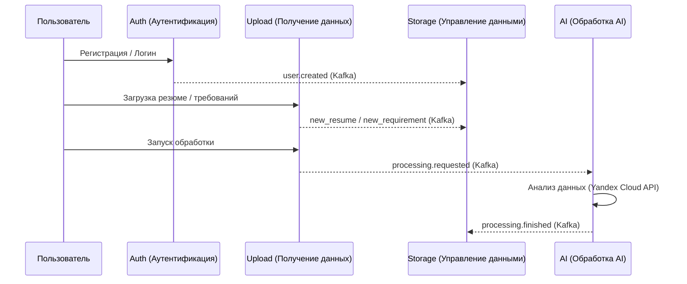

# **Общая архитектура системы микросервисов**

## 📌 Обзор

Система состоит из четырёх микросервисов, каждый из которых отвечает за свою часть логики.
Все сервисы взаимодействуют между собой через **Kafka** и обмениваются данными в **Redis** и **PostgreSQL**.

Стек: **Python, FastAPI, SQLAlchemy, PostgreSQL, Aiokafka, Redis, Pytest, Docker**

Основные компоненты:

* **Kafka** — основной канал асинхронного обмена событиями между сервисами.
* **Redis** — используется как кэш и для хранения частозапрашиваеммых данных и временных меток о выполненных действиях.
* **PostgreSQL** — основное хранилище данных пользователей, резюме, требований и результатов обработки.
* **Yandex Cloud API** — используется сервисом AI-обработки для анализа резюме.

---

## Инструкция по запуску проекта

### 1. Склонировать репозиторий

```bash
git clone https://github.com/IvanShankin/API_handler_resume_system.git
```

### 2. Создать `.env` файл

Создайте в корневой директории проекта должен находиться файл `.env`, Создайте его опираясь на `.example.env`.

Изменить только `SECRET_KEY`, `YANDEX_CLOUD_API_KEY`, `YANDEX_CLOUD_FOLDER_ID`. Остальное менят только если уверен, 
что делаешь.

### 3. Запустить docker compose

В **корневой директории проекта** выполнить:

```bash
docker compose up -d
```

### Доступ к сервисам

Все запросы проходят через **nginx gateway**.

✅ После запуска API будет доступно по адресу:

```
http://localhost:1297
```

---


## 🗂 Состав микросервисов

В каждом микросервисек реализован docker-compose

### 1. **Сервис аутентификации**

* Регистрация и вход пользователей с JWT.
* Ограничение активных сессий, защита от brute-force.
* При регистрации отправляет событие по топику `user.created` в Kafka.
* Кэширует данные пользователей в Redis.
* Ссылка: https://github.com/IvanShankin/API_handler_resume_auth_service

### 2. **Сервис получения данных от пользователя**

* Получает от пользователя резюме и требования.
* Сохраняет их в БД и Redis.
* Отправляет события в Kafka по топикам:
  * `user.created`
  * `resume.created`
  * `resume.deleted`
  * `requirement.created`
  * `requirement.deleted`
  * `processing.requested`
  * `processing.deleted`
* Отправляет запросы на AI-обработку в Kafka (`AI_handler` → `processing.finished`).
*  Ссылка: https://github.com/IvanShankin/API_handler_resume_upload_service

### 3. **Сервис управления данными пользователей**

* Хранит и отдает информацию о пользователях, резюме, требованиях и обработках.
* Получает данные через Kafka по всем топикам:
  * `user.created`
  * `resume.created`
  * `resume.deleted`
  * `requirement.created`
  * `requirement.deleted`
  * `processing.requested`
  * `processing.finished`
  * `processing.deleted`
* Кэширует их в Redis.
* Ссылка: https://github.com/IvanShankin/API_handler_resume_storage_service

### 4. **Сервис AI-обработки**
* Получает из Kafka по топику `processing.requested`.
* Запрашивает Yandex Cloud API для анализа резюме по требованиям.
* Отправляет результаты:
  * В Kafka (`processing.finished`) → для отправки пользователю.
* Ссылка: https://github.com/IvanShankin/API_handler_resume_AI_handler_service

---

## 📤 Поток данных (пример)

1. Пользователь регистрируется в **Auth** → `user.created` в Kafka.
2. **Storage** и ***Upload** получает событие и сохраняет данные.
3. Пользователь загружает резюме в **Upload** → `upload/create_resume/file` 
4. Пользователь загружает требования в **Upload** → `upload/create_requirement/file` 
5. Все данные передаются по Kafka и **Storage** сохраняет их.
6. Пользователь запускает обработку в **Upload** → `upload/start_processing` 
7. **Upload** отправляет `processing.requested` в Kafka.
8. **AI** читает `processing.requested`, обращается к Yandex Cloud API, отправляет:
   * `processing.finished` в Kafka → сохраняет **Storage**.
9. **Storage** сохраняет результат.

---

## 🔗 Взаимодействие сервисов


```mermaid
sequenceDiagram
participant User as Пользователь
participant Auth as Auth (Аутентификация)
participant Upload as Upload (Получение данных)
participant Storage as Storage (Управление данными)
participant AI as AI (Обработка AI)

User ->> Auth: Регистрация / Логин
Auth -->> Storage: user.created (Kafka)

User ->> Upload: Загрузка резюме / требований
Upload -->> Storage: new_resume / new_requirement (Kafka)

User ->> Upload: Запуск обработки
Upload -->> AI: processing.requested (Kafka)

AI ->> AI: Анализ данных (Yandex Cloud API)
AI -->> Storage: processing.finished (Kafka)
```


## Движение данных в kafka

## Пользователь
- При создании нового пользователя:  
```python
topic = 'user.created'
json = {
   'user_id': int,
   'username': str,
   'full_name': str,
   'created_at': str,
}
```
**Отправляет:** Upload   
**Принимает:** Storage


## Резюме
- При создании нового резюме:  
```python
topic = 'resume.created'
json = {
  'resume_id': int,
  'user_id': int,
  'requirement_id': int,
  'resume': str
}
```
**Отправляет:** Upload   
**Принимает:** Storage


- При удалении резюме:  
```python
topic = 'resume.deleted'
json = {
   'resume_ids': List[int],
   'processing_ids': List[int],
   'requirement_ids': List[int],
}
```
**Отправляет:** Upload  
**Принимает:** Storage


## Требования 
- При создании новых требований:  
```python
topic = 'requirement.created'
key = 'requirement.created',
json = {
    'requirement_id': int, 
    'user_id': int,
    'requirement': str
}
```
**Отправляет:** Upload  
**Принимает:** Storage


- При удалении требований:  
```python
topic = 'requirement.deleted'
json = {
    'requirement_ids': List[int],
    'resume_ids': List[int],
    'processing_ids': List[int],
    'user_id': int
}
```
**Отправляет:** Upload   
**Принимает:** Storage

  
## обработки AI 
     
### При запросе на новую обработку:
```python
topic = 'processing.requested'
json = {
    'processing_id': int, 
    'resume_id': int, 
    'requirement_id': int, 
    'user_id': int,
    'resume': str,
    'requirement': str,
}
```
**Отправляет:** Upload   
**Принимает:** AI_handler
  

### При ответе от AI:  
```python
topic = 'processing.finished'
json = {
    "processing_id": int,
    "success": bool,
    "message_error": str,
    "wait_seconds": int,
    "score": int,
    "matches": list,
    "recommendation": str,
    "verdict": str,
}
```
**Отправляет:** AI_handler   
**Принимает:** Storage
     
### При удалении обработок:  
```python
topic = 'processing.deleted'
json = {
    'processing_ids': List[int],
    'resume_ids': List[int]
}
```
**Отправляет:** Upload   
**Принимает:** Storage
